# Подборки карт

[Главная](index.html) | **Подборки карт** | [Полный справочник](cards.html)

## Топ-5 карт по урону на 6 кубиках

### По стихии карты

#### Вода

| Место | ID | Карта | Σ эффект макс | Σ эффект средний |
| ---: | ---: | --- | --- | --- |
| 1 | 80 | &nbsp; 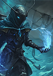 Сул'Тан Мерцающий | 75987 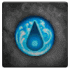  | 38510 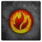 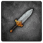 |
| 2 | 68 | &nbsp; 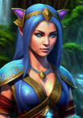 Мерра Дочь Дождя | 72399   | 36693   |
| 3 | 58 | &nbsp;  Повелитель Бездны | 69420   | 35205   |
| 4 | 41 | &nbsp; 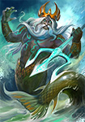 Нептун | 66588   | 34043   |
| 5 | 36 | &nbsp; 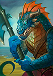 Генерал Водоворот | 60831   | 31186   |

#### Сила/HIT

| Место | ID | Карта | Σ эффект макс | Σ эффект средний |
| ---: | ---: | --- | --- | --- |
| 1 | 75 | &nbsp;  Миг-Мог Домушник | 59100   | 29550   |
| 2 | 53 | &nbsp; 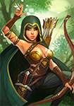 Наемница Фрида | 57798   | 28899   |
| 3 | 54 | &nbsp; 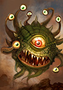 Хиккас Злобоглаз | 55200   | 27600   |
| 4 | 43 | &nbsp;  Капитан Норс | 49728   | 24864   |
| 5 | 42 | &nbsp; 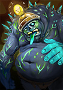 Механик Догр | 46218   | 23109   |

#### Огонь

| Место | ID | Карта | Σ эффект макс | Σ эффект средний |
| ---: | ---: | --- | --- | --- |
| 1 | 81 | &nbsp; 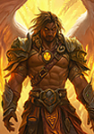 Архангел Кастиэль | 80490   | 55002   |
| 2 | 56 | &nbsp; 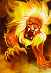 Огненный Рык | 76476   | 42422   |
| 3 | 67 | &nbsp; 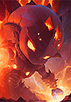 Морок Возрожденный | 76264   | 42544   |
| 4 | 87 | &nbsp; 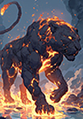 Душа Кагэ | 69376   | 39600   |
| 5 | 84 | &nbsp;  Багровый Барон | 65970   | 37753   |

#### Природа

| Место | ID | Карта | Σ эффект макс | Σ эффект средний |
| ---: | ---: | --- | --- | --- |
| 1 | 88 | &nbsp; 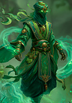 Зеленар Лесной Дух | 68274   | 44769   |
| 2 | 85 | &nbsp;  Алый Капюшон | 67800   | 44281   |
| 3 | 69 | &nbsp;  Фолки Дуборук | 63126   | 40177   |
| 4 | 74 | &nbsp; 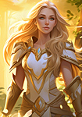 Муза Любви | 60996   | 40743   |
| 5 | 52 | &nbsp; 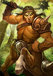 Хокар Подкованный | 59646   | 38429   |

### По редкости

#### Простая

| Место | ID | Карта | Σ эффект макс | Σ эффект средний |
| ---: | ---: | --- | --- | --- |
| 1 | 75 | &nbsp;  Миг-Мог Домушник | 59100   | 29550   |
| 2 | 53 | &nbsp;  Наемница Фрида | 57798   | 28899   |
| 3 | 54 | &nbsp;  Хиккас Злобоглаз | 55200   | 27600   |
| 4 | 43 | &nbsp;  Капитан Норс | 49728   | 24864   |
| 5 | 42 | &nbsp;  Механик Догр | 46218   | 23109   |

#### Необычная

| Место | ID | Карта | Σ эффект макс | Σ эффект средний |
| ---: | ---: | --- | --- | --- |
| 1 | 71 | &nbsp; 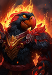 Корвид Огнекрылый | 55812   | 27906   |
| 2 | 44 | &nbsp; 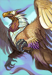 Грифон Рохейнс | 55260   | 27630   |
| 3 | 72 | &nbsp;  Эрда Слеза Океана | 54612   | 27306   |
| 4 | 38 | &nbsp; 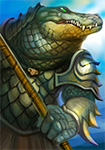 Крокос Элрод | 53622   | 26811   |
| 5 | 57 | &nbsp; 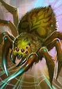 Живоглот | 53424   | 26712   |

#### Редкая

| Место | ID | Карта | Σ эффект макс | Σ эффект средний |
| ---: | ---: | --- | --- | --- |
| 1 | 81 | &nbsp;  Архангел Кастиэль | 80490   | 55002   |
| 2 | 56 | &nbsp;  Огненный Рык | 76476   | 42422   |
| 3 | 67 | &nbsp;  Морок Возрожденный | 76264   | 42544   |
| 4 | 80 | &nbsp;  Сул'Тан Мерцающий | 75987   | 38510   |
| 5 | 68 | &nbsp;  Мерра Дочь Дождя | 72399   | 36693   |

## Топ-5 карт по урону на среднем ролле

Здесь показан не идеальный, а более практический средний ролл кубиков. Простые карты из этого раздела исключены, потому что для них зависимость от броска почти линейна.

### По стихии карты

#### Вода

| Место | ID | Карта | Σ эффект макс | Σ эффект средний |
| ---: | ---: | --- | --- | --- |
| 1 | 80 | &nbsp;  Сул'Тан Мерцающий | 75987   | 38510   |
| 2 | 68 | &nbsp;  Мерра Дочь Дождя | 72399   | 36693   |
| 3 | 58 | &nbsp;  Повелитель Бездны | 69420   | 35205   |
| 4 | 41 | &nbsp;  Нептун | 66588   | 34043   |
| 5 | 86 | &nbsp;  Блип-Блоп 404 | 57516   | 33148   |

#### Огонь

| Место | ID | Карта | Σ эффект макс | Σ эффект средний |
| ---: | ---: | --- | --- | --- |
| 1 | 81 | &nbsp;  Архангел Кастиэль | 80490   | 55002   |
| 2 | 67 | &nbsp;  Морок Возрожденный | 76264   | 42544   |
| 3 | 56 | &nbsp;  Огненный Рык | 76476   | 42422   |
| 4 | 45 | &nbsp; 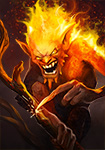 Поджигатель | 60285   | 42228   |
| 5 | 87 | &nbsp;  Душа Кагэ | 69376   | 39600   |

#### Природа

| Место | ID | Карта | Σ эффект макс | Σ эффект средний |
| ---: | ---: | --- | --- | --- |
| 1 | 82 | &nbsp; 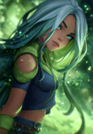 Муза Жизни | 48144   | 45360   |
| 2 | 88 | &nbsp;  Зеленар Лесной Дух | 68274   | 44769   |
| 3 | 85 | &nbsp;  Алый Капюшон | 67800   | 44281   |
| 4 | 73 | &nbsp; 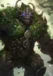 Страж Темнолесья | 45930   | 43375   |
| 5 | 74 | &nbsp;  Муза Любви | 60996   | 40743   |

### По редкости

#### Необычная

| Место | ID | Карта | Σ эффект макс | Σ эффект средний |
| ---: | ---: | --- | --- | --- |
| 1 | 71 | &nbsp;  Корвид Огнекрылый | 55812   | 27906   |
| 2 | 44 | &nbsp;  Грифон Рохейнс | 55260   | 27630   |
| 3 | 72 | &nbsp;  Эрда Слеза Океана | 54612   | 27306   |
| 4 | 38 | &nbsp;  Крокос Элрод | 53622   | 26811   |
| 5 | 57 | &nbsp;  Живоглот | 53424   | 26712   |

#### Редкая

| Место | ID | Карта | Σ эффект макс | Σ эффект средний |
| ---: | ---: | --- | --- | --- |
| 1 | 81 | &nbsp;  Архангел Кастиэль | 80490   | 55002   |
| 2 | 82 | &nbsp;  Муза Жизни | 48144   | 45360   |
| 3 | 88 | &nbsp;  Зеленар Лесной Дух | 68274   | 44769   |
| 4 | 85 | &nbsp;  Алый Капюшон | 67800   | 44281   |
| 5 | 73 | &nbsp;  Страж Темнолесья | 45930   | 43375   |

## Карты с нестандартной оптимальной комбинацией

В этот список входят карты, у которых максимальный урон на 6 кубиках достигается не через `6` кубиков своей основной стихии, а через смешанную раскладку.

### Огонь

| ID | Карта | Σ эффект макс | Σ эффект средний |
| ---: | --- | --- | --- |
| 67 | &nbsp;  Морок Возрожденный | 76264   | 42544   |
| 87 | &nbsp;  Душа Кагэ | 69376   | 39600   |
| 84 | &nbsp;  Багровый Барон | 65970   | 37753   |
| 79 | &nbsp; 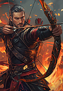 Тарвин’Хан Огнестрел | 64250   | 37116   |
| 64 | &nbsp; 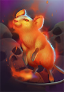 Жгучая Лорса | 61886   | 36194   |
| 50 | &nbsp;  Куггат Мрачный | 60876   | 34774   |
| 76 | &nbsp; 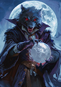 Фенрир Седогривый | 60426   | 34468   |
| 61 | &nbsp;  Муза Танца | 59544   | 34121   |
| 47 | &nbsp; 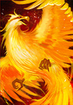 Губитель Миров | 57626   | 33464   |
| 34 | &nbsp; 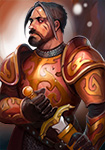 Кир Воитель | 52868   | 30196   |
| 28 | &nbsp; 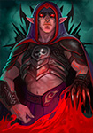 Кровавый Верон | 52052   | 29988   |
| 29 | &nbsp; 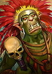 Оракул Акс | 50350   | 28906   |

### Вода

| ID | Карта | Σ эффект макс | Σ эффект средний |
| ---: | --- | --- | --- |
| 86 | &nbsp;  Блип-Блоп 404 | 57516   | 33148   |
| 83 | &nbsp; 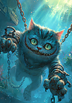 Чешир | 56805   | 32665   |
| 77 | &nbsp;  Мистер Блеф | 56358   | 32775   |
| 49 | &nbsp; 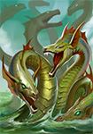 Гидра | 54510   | 31482   |
| 65 | &nbsp; 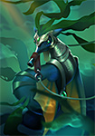 Резвый Волнорез | 53682   | 31231   |
| 70 | &nbsp; 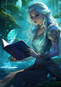 Муза Поэзии | 53313   | 30682   |
| 46 | &nbsp; 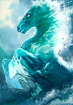 Рёв Волн | 51264   | 29889   |
| 62 | &nbsp; 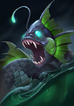 Моргот Глубоководный | 50982   | 29467   |
| 33 | &nbsp; 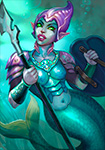 Старшая Элуна | 48807   | 28575   |
| 35 | &nbsp; 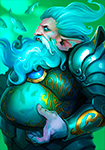 Царь Эхтий Первый | 46566   | 27369   |

[Наверх](#подборки-карт) | [Главная](index.html) | [Полный справочник](cards.html)
