[Главная](index.html) | [Подборки карт](best-cards.html) | **Полный справочник**

- Текущий максимум уровня карт равен максимальному уровню игрока: `124`.
- Максимум звёзд вынесен в отдельную таблицу ниже по редкостям.
- В таблицах не учитываются внешние бонусы аккаунта: временные усиления, бонусы недели, бонусы сфер, гильдейские бонусы и другие дополнительные прибавки.
- Для карт Природы в `Σ эффект` учтено: урон + лечение.

- `Σ эффект макс` считается только по встроенным параметрам карты, без внешних бонусов.
- Для простых и необычных карт используется правило `6 x урон основной стихии`.
- Для редких карт перебираются все варианты распределения 6 кубиков; в расчёт идёт только урон, лечение в рейтинг урона не включается.
- Для редких карт с усилением второго умения считается, что каждое его срабатывание усиливает каждый обычный удар на величину бафа.
- Для редких карт с преобразованием стихии считается, что каждое срабатывание второго умения даёт один дополнительный обычный удар.
- `Урон на среднем ролле` показывает результат для более практичного, неидеального ролла кубиков. `Средний ролл кубиков` показывает такую усреднённую раскладку без дробных значений.

Всего карт: **88**.

| ID | Карта | Редкость | Стихия | Skill1 урон | Skill2 тип | Skill2 урон | Skill2 лечение | Skill2 баф | Skill3 урон | Σ эффект макс | Оптимальная комбинация кубиков | Урон на среднем ролле | Средний ролл кубиков |
| ---: | --- | --- | --- | --- | --- | --- | --- | --- | --- | ---: | --- | ---: | --- |
| 1 | Хрупкий Тоунт 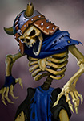 | Простая | Сила | 250 | — | — | — | — | — | 1500 | 6 силы | 750 | 1 огня, 1 природы, 1 воды, 3 силы |
| 2 | Адская Гончая 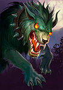 | Необычная | Природа | 7279 | Сила | 4899 | — | — | — | 43674 | 6 природы | 21837 | 1 огня, 3 природы, 1 воды, 1 силы |
| 3 | Лорд Ночи  | Простая | Сила | 7660 | — | — | — | — | — | 45960 | 6 силы | 22980 | 1 огня, 1 природы, 1 воды, 3 силы |
| 4 | Жабр 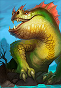 | Необычная | Вода | 7092 | Сила | 4356 | — | — | — | 42552 | 6 воды | 21276 | 1 огня, 1 природы, 3 воды, 1 силы |
| 5 | Лемут Тролль 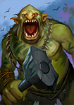 | Простая | Сила | 6163 | — | — | — | — | — | 36978 | 6 силы | 18489 | 1 огня, 1 природы, 1 воды, 3 силы |
| 6 | Галан Варвар  | Простая | Сила | 7428 | — | — | — | — | — | 44568 | 6 силы | 22284 | 1 огня, 1 природы, 1 воды, 3 силы |
| 7 | Шаман Ветра  | Простая | Сила | 7633 | — | — | — | — | — | 45798 | 6 силы | 22899 | 1 огня, 1 природы, 1 воды, 3 силы |
| 8 | Огр Вахо 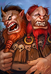 | Простая | Сила | 6410 | — | — | — | — | — | 38460 | 6 силы | 19230 | 1 огня, 1 природы, 1 воды, 3 силы |
| 9 | Шон Зомби  | Простая | Сила | 7068 | — | — | — | — | — | 42408 | 6 силы | 21204 | 1 огня, 1 природы, 1 воды, 3 силы |
| 10 | Дух Праздности 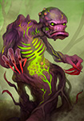 | Простая | Сила | 6193 | — | — | — | — | — | 37158 | 6 силы | 18579 | 1 огня, 1 природы, 1 воды, 3 силы |
| 11 | Каменный Эквал 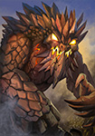 | Простая | Сила | 6823 | — | — | — | — | — | 40938 | 6 силы | 20469 | 1 огня, 1 природы, 1 воды, 3 силы |
| 12 | Кракен 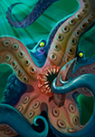 | Необычная | Вода | 7578 | Сила | 5137 | — | — | — | 45468 | 6 воды | 22734 | 1 огня, 1 природы, 3 воды, 1 силы |
| 13 | Младшая Элуна  | Простая | Сила | 6780 | — | — | — | — | — | 40680 | 6 силы | 20340 | 1 огня, 1 природы, 1 воды, 3 силы |
| 14 | Ядовитый Тарт 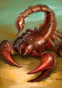 | Простая | Сила | 7630 | — | — | — | — | — | 45780 | 6 силы | 22890 | 1 огня, 1 природы, 1 воды, 3 силы |
| 15 | Киван Бурый 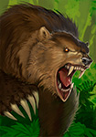 | Необычная | Природа | 7068 | Сила | 5157 | — | — | — | 42408 | 6 природы | 21204 | 1 огня, 3 природы, 1 воды, 1 силы |
| 16 | Белый Фут 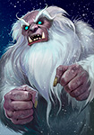 | Простая | Сила | 6725 | — | — | — | — | — | 40350 | 6 силы | 20175 | 1 огня, 1 природы, 1 воды, 3 силы |
| 17 | Огненный Корн 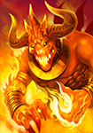 | Необычная | Огонь | 8152 | Сила | 5425 | — | — | — | 48912 | 6 огня | 24456 | 3 огня, 1 природы, 1 воды, 1 силы |
| 18 | Ведьма Рона  | Необычная | Огонь | 7909 | Сила | 4883 | — | — | — | 47454 | 6 огня | 23727 | 3 огня, 1 природы, 1 воды, 1 силы |
| 19 | Утопец 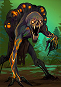 | Простая | Сила | 6185 | — | — | — | — | — | 37110 | 6 силы | 18555 | 1 огня, 1 природы, 1 воды, 3 силы |
| 20 | Аметист 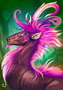 | Простая | Сила | 7058 | — | — | — | — | — | 42348 | 6 силы | 21174 | 1 огня, 1 природы, 1 воды, 3 силы |
| 21 | Боров Грул 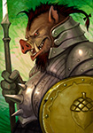 | Простая | Сила | 7103 | — | — | — | — | — | 42618 | 6 силы | 21309 | 1 огня, 1 природы, 1 воды, 3 силы |
| 22 | Принц Мёртвых  | Необычная | Огонь | 8096 | Сила | 5360 | — | — | — | 48576 | 6 огня | 24288 | 3 огня, 1 природы, 1 воды, 1 силы |
| 23 | Вуд 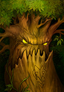 | Необычная | Природа | 6993 | Сила | 5088 | — | — | — | 41958 | 6 природы | 20979 | 1 огня, 3 природы, 1 воды, 1 силы |
| 24 | Кристальный Гаан 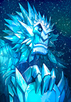 | Необычная | Вода | 7565 | Сила | 4822 | — | — | — | 45390 | 6 воды | 22695 | 1 огня, 1 природы, 3 воды, 1 силы |
| 25 | Принцесса Эльфов 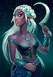 | Необычная | Природа | 7914 | Сила | 4278 | — | — | — | 47484 | 6 природы | 23742 | 1 огня, 3 природы, 1 воды, 1 силы |
| 26 | Опасный Ил 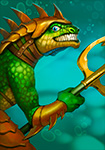 | Необычная | Вода | 7891 | Сила | 4563 | — | — | — | 47346 | 6 воды | 23673 | 1 огня, 1 природы, 3 воды, 1 силы |
| 27 | Фея Мара  | Необычная | Огонь | 7320 | Сила | 4851 | — | — | — | 43920 | 6 огня | 21960 | 3 огня, 1 природы, 1 воды, 1 силы |
| 28 | Кровавый Верон  | Редкая | Огонь | 5801 | Огонь+Огонь | 5598 | — | 1839 | 5148 | 52052 | 4 огня, 2 силы | 36975 | 3 огня, 1 природы, 2 силы |
| 29 | Оракул Акс  | Редкая | Огонь | 6042 | Огонь+Природа | 9653 | — | 2311 | 4858 | 50350 | 2 огня, 2 природы, 2 силы | 36075 | 2 огня, 1 природы, 1 воды, 2 силы |
| 30 | Киван Целитель  | Редкая | Природа | 6388 | Природа+Природа | — | 11271 | — | 4595 | 38328 | 6 природы | 28354 | 1 огня, 3 природы, 2 силы |
| 31 | Говорящий Посох  | Редкая | Природа | 6361 | Природа+Вода | — | 11874 | — | 4856 | 38166 | 6 природы | 28795 | 1 огня, 3 природы, 2 силы |
| 32 | Дионея 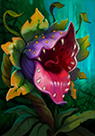 | Редкая | Природа | 6660 | Природа+Огонь | — | 12429 | — | 5164 | 39960 | 6 природы | 30308 | 1 огня, 3 природы, 2 силы |
| 33 | Старшая Элуна  | Редкая | Вода | 6915 | Вода+Природа | 3963 | — | — | 5391 | 48807 | 3 природы, 3 воды | 37929 | 1 огня, 2 природы, 2 воды, 1 силы |
| 34 | Кир Воитель  | Редкая | Огонь | 6388 | Огонь+Вода | 10195 | — | 2626 | 4599 | 52868 | 2 огня, 2 воды, 2 силы | 43017 | 2 огня, 1 природы, 2 воды, 1 силы |
| 35 | Царь Эхтий Первый  | Редкая | Вода | 6674 | Вода+Огонь | 3675 | — | — | 5173 | 46566 | 3 огня, 3 воды | 36217 | 2 огня, 1 природы, 2 воды, 1 силы |
| 36 | Генерал Водоворот  | Редкая | Вода | 6035 | Вода+Вода | 3333 | — | — | 4874 | 60831 | 6 воды | 31186 | 1 огня, 1 природы, 3 воды, 1 силы |
| 37 | Леший Филь 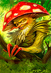 | Необычная | Природа | 8811 | Сила | 5785 | — | — | — | 52866 | 6 природы | 26433 | 1 огня, 3 природы, 1 воды, 1 силы |
| 38 | Крокос Элрод  | Необычная | Вода | 8937 | Сила | 5216 | — | — | — | 53622 | 6 воды | 26811 | 1 огня, 1 природы, 3 воды, 1 силы |
| 39 | Братья Спор  | Редкая | Природа | 7117 | Природа+Природа | — | 13473 | — | 5673 | 42702 | 6 природы | 32697 | 1 огня, 3 природы, 2 силы |
| 40 | Пламенная Френа 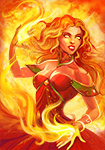 | Необычная | Огонь | 8890 | Сила | 5412 | — | — | — | 53340 | 6 огня | 26670 | 3 огня, 1 природы, 1 воды, 1 силы |
| 41 | Нептун  | Редкая | Вода | 6674 | Вода+Вода | 3675 | — | — | 5173 | 66588 | 6 воды | 34043 | 1 огня, 1 природы, 3 воды, 1 силы |
| 42 | Механик Догр  | Простая | Сила | 7703 | — | — | — | — | — | 46218 | 6 силы | 23109 | 1 огня, 1 природы, 1 воды, 3 силы |
| 43 | Капитан Норс  | Простая | Сила | 8288 | — | — | — | — | — | 49728 | 6 силы | 24864 | 1 огня, 1 природы, 1 воды, 3 силы |
| 44 | Грифон Рохейнс  | Необычная | Природа | 9210 | Сила | 5070 | — | — | — | 55260 | 6 природы | 27630 | 1 огня, 3 природы, 1 воды, 1 силы |
| 45 | Поджигатель  | Редкая | Огонь | 6957 | Огонь+Огонь | 6181 | — | 2122 | 5466 | 60285 | 6 огня | 42228 | 3 огня, 1 природы, 2 силы |
| 46 | Рёв Волн  | Редкая | Вода | 6982 | Вода+Природа | 4287 | — | — | 5819 | 51264 | 3 природы, 3 воды | 39995 | 1 огня, 2 природы, 2 воды, 1 силы |
| 47 | Губитель Миров  | Редкая | Огонь | 7261 | Огонь+Природа | 10281 | — | 2610 | 6051 | 57626 | 2 огня, 2 природы, 2 силы | 42125 | 2 огня, 1 природы, 1 воды, 2 силы |
| 48 | Кошанна 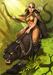 | Редкая | Природа | 9309 | Природа+Огонь | — | 12020 | — | 6568 | 55854 | 6 природы | 41063 | 1 огня, 3 природы, 2 силы |
| 49 | Гидра  | Редкая | Вода | 7000 | Вода+Огонь | 4858 | — | — | 6312 | 54510 | 3 огня, 3 воды | 42652 | 2 огня, 1 природы, 2 воды, 1 силы |
| 50 | Куггат Мрачный  | Редкая | Огонь | 7248 | Огонь+Вода | 10782 | — | 2912 | 6584 | 60876 | 2 огня, 2 воды, 2 силы | 44270 | 2 огня, 1 природы, 1 воды, 2 силы |
| 51 | Черепаха Анука 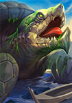 | Необычная | Вода | 8604 | Сила | 5439 | — | — | — | 51624 | 6 воды | 25812 | 1 огня, 1 природы, 3 воды, 1 силы |
| 52 | Хокар Подкованный  | Редкая | Природа | 9941 | Природа+Вода | — | 11673 | — | 6874 | 59646 | 6 природы | 43571 | 1 огня, 3 природы, 2 силы |
| 53 | Наемница Фрида  | Простая | Сила | 9633 | — | — | — | — | — | 57798 | 6 силы | 28899 | 1 огня, 1 природы, 1 воды, 3 силы |
| 54 | Хиккас Злобоглаз  | Простая | Сила | 9200 | — | — | — | — | — | 55200 | 6 силы | 27600 | 1 огня, 1 природы, 1 воды, 3 силы |
| 55 | Саламандра 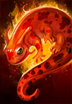 | Необычная | Огонь | 8199 | Сила | 6021 | — | — | — | 49194 | 6 огня | 24597 | 3 огня, 1 природы, 1 воды, 1 силы |
| 56 | Огненный Рык  | Редкая | Огонь | 7509 | Огонь+Огонь | 10474 | — | 2590 | 5875 | 76476 | 6 огня | 42422 | 2 огня, 1 природы, 1 воды, 2 силы |
| 57 | Живоглот  | Необычная | Природа | 8904 | Сила | 5279 | — | — | — | 53424 | 6 природы | 26712 | 1 огня, 3 природы, 1 воды, 1 силы |
| 58 | Повелитель Бездны  | Редкая | Вода | 6665 | Вода+Вода | 4410 | — | — | 5400 | 69420 | 6 воды | 35205 | 1 огня, 1 природы, 3 воды, 1 силы |
| 59 | Ифритус Эльг  | Необычная | Огонь | 8028 | Сила | 5940 | — | — | — | 48168 | 6 огня | 24084 | 3 огня, 1 природы, 1 воды, 1 силы |
| 60 | Циклон 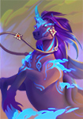 | Редкая | Природа | 6856 | Природа+Природа | — | 12119 | — | 6690 | 41136 | 6 природы | 33948 | 1 огня, 3 природы, 2 силы |
| 61 | Муза Танца  | Редкая | Огонь | 6917 | Огонь+Природа | 10960 | — | 2568 | 6759 | 59544 | 2 огня, 2 природы, 2 силы | 43448 | 2 огня, 1 природы, 1 воды, 2 силы |
| 62 | Моргот Глубоководный  | Редкая | Вода | 6699 | Вода+Природа | 4521 | — | — | 5774 | 50982 | 3 природы, 3 воды | 39762 | 1 огня, 2 природы, 2 воды, 1 силы |
| 63 | Рахиссса  | Редкая | Природа | 8944 | Природа+Огонь | — | 13298 | — | 6242 | 53664 | 6 природы | 39316 | 1 огня, 3 природы, 2 силы |
| 64 | Жгучая Лорса  | Редкая | Огонь | 7911 | Огонь+Вода | 10764 | — | 2660 | 6948 | 61886 | 2 огня, 2 воды, 2 силы | 45802 | 2 огня, 1 природы, 1 воды, 2 силы |
| 65 | Резвый Волнорез  | Редкая | Вода | 7248 | Вода+Огонь | 4557 | — | — | 6089 | 53682 | 3 огня, 3 воды | 41877 | 2 огня, 1 природы, 2 воды, 1 силы |
| 66 | Кириндар Охотник 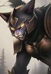 | Редкая | Природа | 8778 | Природа+Огонь | — | 12663 | — | 6924 | 52668 | 6 природы | 40182 | 1 огня, 3 природы, 2 силы |
| 67 | Морок Возрожденный  | Редкая | Огонь | 7529 | Огонь+Огонь | 9068 | — | 3117 | 7772 | 76264 | 4 огня, 2 силы | 53433 | 3 огня, 1 природы, 2 силы |
| 68 | Мерра Дочь Дождя  | Редкая | Вода | 6917 | Вода+Вода | 4656 | — | — | 5643 | 72399 | 6 воды | 36693 | 1 огня, 1 природы, 3 воды, 1 силы |
| 69 | Фолки Дуборук  | Редкая | Природа | 10521 | Природа+Вода | — | 11937 | — | 7198 | 63126 | 6 природы | 45959 | 1 огня, 3 природы, 2 силы |
| 70 | Муза Поэзии  | Редкая | Вода | 7232 | Вода+Огонь | 4860 | — | — | 5679 | 53313 | 3 огня, 3 воды | 41221 | 2 огня, 1 природы, 2 воды, 1 силы |
| 71 | Корвид Огнекрылый  | Необычная | Огонь | 9302 | Сила | 6075 | — | — | — | 55812 | 6 огня | 27906 | 3 огня, 1 природы, 1 воды, 1 силы |
| 72 | Эрда Слеза Океана  | Необычная | Вода | 9102 | Сила | 6089 | — | — | — | 54612 | 6 воды | 27306 | 1 огня, 1 природы, 3 воды, 1 силы |
| 73 | Страж Темнолесья  | Редкая | Природа | 7655 | Природа+Природа | — | 13536 | — | 6874 | 45930 | 6 природы | 36713 | 1 огня, 3 природы, 2 силы |
| 74 | Муза Любви  | Редкая | Природа | 10166 | Природа+Вода | — | 13314 | — | 7097 | 60996 | 6 природы | 44692 | 1 огня, 3 природы, 2 силы |
| 75 | Миг-Мог Домушник  | Простая | Сила | 9850 | — | — | — | — | — | 59100 | 6 силы | 29550 | 1 огня, 1 природы, 1 воды, 3 силы |
| 76 | Фенрир Седогривый  | Редкая | Огонь | 7115 | Огонь+Природа | 10418 | — | 2860 | 6960 | 60426 | 2 огня, 2 природы, 2 силы | 44288 | 2 огня, 1 природы, 1 воды, 2 силы |
| 77 | Мистер Блеф  | Редкая | Вода | 7470 | Вода+Природа | 4797 | — | — | 6519 | 56358 | 3 природы, 3 воды | 44091 | 1 огня, 2 природы, 2 воды, 1 силы |
| 78 | Эйрон Буревест 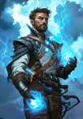 | Редкая | Природа | 9102 | Природа+Огонь | — | 13226 | — | 6928 | 54612 | 6 природы | 41162 | 1 огня, 3 природы, 2 силы |
| 79 | Тарвин’Хан Огнестрел  | Редкая | Огонь | 7941 | Огонь+Вода | 11050 | — | 2950 | 7234 | 64250 | 2 огня, 2 воды, 2 силы | 47300 | 2 огня, 1 природы, 1 воды, 2 силы |
| 80 | Сул'Тан Мерцающий  | Редкая | Вода | 7209 | Вода+Вода | 4939 | — | — | 5972 | 75987 | 6 воды | 38510 | 1 огня, 1 природы, 3 воды, 1 силы |
| 81 | Архангел Кастиэль  | Редкая | Огонь | 8132 | Огонь+Огонь | 10566 | — | 3085 | 6935 | 80490 | 6 огня | 55002 | 3 огня, 1 природы, 2 силы |
| 82 | Муза Жизни  | Редкая | Природа | 8024 | Природа+Природа | — | 13926 | — | 7362 | 48144 | 6 природы | 38796 | 1 огня, 3 природы, 2 силы |
| 83 | Чешир  | Редкая | Вода | 7504 | Вода+Огонь | 5205 | — | — | 6226 | 56805 | 3 огня, 3 воды | 44096 | 2 огня, 1 природы, 2 воды, 1 силы |
| 84 | Багровый Барон  | Редкая | Огонь | 7995 | Огонь+Природа | 10719 | — | 3227 | 7817 | 65970 | 2 огня, 2 природы, 2 силы | 48797 | 2 огня, 1 природы, 1 воды, 2 силы |
| 85 | Алый Капюшон  | Редкая | Природа | 11300 | Природа+Вода | — | 14265 | — | 7416 | 67800 | 6 природы | 48732 | 1 огня, 3 природы, 2 силы |
| 86 | Блип-Блоп 404  | Редкая | Вода | 7772 | Вода+Природа | 5196 | — | — | 6204 | 57516 | 3 природы, 3 воды | 44548 | 1 огня, 2 природы, 2 воды, 1 силы |
| 87 | Душа Кагэ  | Редкая | Огонь | 8465 | Огонь+Вода | 11311 | — | 3553 | 7806 | 69376 | 2 огня, 2 воды, 2 силы | 50959 | 2 огня, 1 природы, 1 воды, 2 силы |
| 88 | Зеленар Лесной Дух  | Редкая | Природа | 11379 | Природа+Огонь | — | 14574 | — | 7437 | 68274 | 6 природы | 49011 | 1 огня, 3 природы, 2 силы |

[Наверх](#справочник-карт) | [Главная](index.html) | [Подборки карт](best-cards.html)
